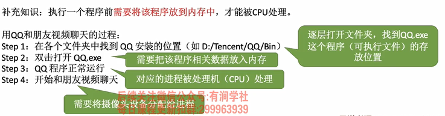

## 操作系统的概念
- 操作系统（Operating System， OS）
   > 系统资源的管理者, 向上层提供方便的服务, 最接近硬件的一层软件
   - 是指控制和管理整个计算机系统的硬件和软件资源，并合理地组织调度计算机的工作和资源的分配 
   - 以提供给用户和其他软件方便的接口和环境
   - 它是计算机系统中最基本的系统软件
### 1、系统资源的管理者
- 处理机管理
- 存储器管理
- 文件管理
- 设备管理
  
### 2、 向上层提供服务 
> 封装: 操作系统把一些丑陋的硬件功能封装成简单易用的服务，使用户能更方便地使用计算机，用户无需关心底层硬件的原理，只需要对操作系统发出命令即可

> 用户直接使用: GUI、命令接口
> 程序员/软件使用: 程序接口
1. GUI图形化用户接口
2. 命令接口
   1. 联机命令接口   交互式命令接口 如:win+r cmd
   2. 脱机命令接口   批处理命令接口 如: .bat文件
3. **程序接口:**
   可以在程序中进行*系统调用*来使用程序接口。普通用户不能直接使用程序接口，只能通过程
序代码*间接*使用
   - **系统调用:** 类似于函数调用，是应用程 序请求操作系统服务的唯一方式.
     > 系统调用 = 广义指令
### 3、最接近硬件的软件
- 需要实现对硬件机器的扩展

## 操作系统的基本特征
- 并发、共享、虚拟、异步  
- 最基本: 并发、共享 没有并发和共享就谈不上虚拟和异步
### 1、并发
    指两个或多个事件在同一时间间隔内发生。这些事件宏观上是同时发生的，但微观上是交替发生的
> 并发: 宏观上同时,微观上交替
> 
> 并行: 同时执行
- 操作系统伴随多道程序技术而出现, 因此,操作系统和并发是一起诞生的
- 单核CPU: 同一时刻只能执行一个程序,各个程序只能并发的执行
- 多核CPU: 可以并行,4核可以并行4个程序
### 2、共享
    共享即资源共享，是指系统中的资源可供内存中多个并发执行的进程共同使用
1. 互斥共享方式
   - 一个时间段内只允许一个进程访问该资源   
   - 如: 摄像头、打印机
2. 同时共享方式
    - 一个时间段内允许多个进程'同时'对它们进行访问
      - 如: 硬盘 微观上是交替的
      - 如: 扬声器 微观上也是同时
3. **并发和共享的关系**
    1. 两者互为存在条件
       - 没有共享性就无法实现并发
       - 没有并发性就用不到共享
### 3、 虚拟
    虚拟是指把一个物理上的实体变为若干个逻辑上的对应物。物理实体（前者）是实际存在的，而逻辑上 对应物（后者）是用户感受到的
1. 空分复用技术
   - 将物理上的实体变为逻辑上的对应物 
   - 如: 虚拟存储
2. 时分复用技术
   - 如: 虚拟处理器
3. 关系
   - 没有并发行就没有虚拟性
### 4、异步
    异步是指，在多道程序环境下，允许多个程序并发执行，但由于资源有限，进程的执行不是一贯到底的， 而是走走停停，以不可预知的速度向前推进，这就是进程的异步性
1. 关系
   - 有并发性,才有可能导致异步

## 操作系统的分类
1. 手工操作阶段
   - 缺点: 
     - 用户独占全机,人机速度矛盾,资源利用率低
2. 批处理阶段
   1. 单道批处理系统
      - 缺点: 
        - 内存中仅能有一道程序运行
        - CPU有大量时间在空闲等待IO完成,资源利用率依旧很低
   2. 多道批处理系统
      > 操作系统正式诞生
      - 优点:
        - 多道程序并发执行
        - 资源利用率大幅提升
      - 缺点
        - 用户响应时间长
        - 没有人机交互功能
          - 无法调试程序
          - 无法在程序运行过程中输入参数
