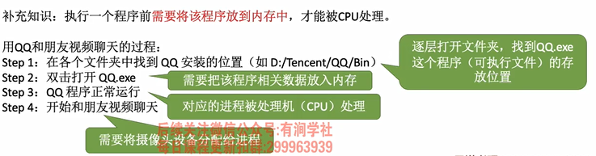
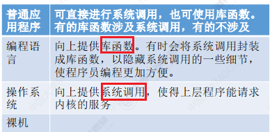
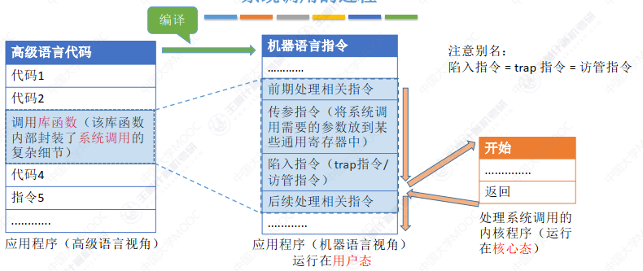

## 一、操作系统的概念

- 操作系统（Operating System， OS）

  > 系统资源的管理者, 向上层提供方便的服务, 最接近硬件的一层软件
  >

  - 是指控制和管理整个计算机系统的硬件和软件资源，并合理地组织调度计算机的工作和资源的分配
  - 以提供给用户和其他软件方便的接口和环境
  - 它是计算机系统中最基本的系统软件

### 1、系统资源的管理者

- 处理机管理
- 存储器管理
- 文件管理
- 设备管理

  

### 2、 向上层提供服务

> 封装: 操作系统把一些丑陋的硬件功能封装成简单易用的服务，使用户能更方便地使用计算机，用户无需关心底层硬件的原理，只需要对操作系统发出命令即可

> 用户直接使用: GUI、命令接口
> 程序员/软件使用: 程序接口

1. GUI图形化用户接口
2. 命令接口
   1. 联机命令接口   交互式命令接口 如:win+r cmd
   2. 脱机命令接口   批处理命令接口 如: .bat文件
3. **程序接口:**
   可以在程序中进行*系统调用*来使用程序接口。普通用户不能直接使用程序接口，只能通过程
   序代码*间接*使用
   - **系统调用:** 类似于函数调用，是应用程 序请求操作系统服务的唯一方式.
     > 系统调用 = 广义指令
     >

### 3、最接近硬件的软件

- 需要实现对硬件机器的扩展

## 二、操作系统的基本特征

- 并发、共享、虚拟、异步
- 最基本: 并发、共享 没有并发和共享就谈不上虚拟和异步

1. 并发

   > 并发: 宏观上同时,微观上交替
   >
   > 并行: 同时执行
   >

   - 指两个或多个事件在同一时间间隔内发生。这些事件宏观上是同时发生的，但微观上是交替发生的
   - 操作系统伴随多道程序技术而出现, 因此,操作系统和并发是一起诞生的
   - 单核CPU: 同一时刻只能执行一个程序,各个程序只能并发的执行
   - 多核CPU: 可以并行,4核可以并行4个程序
2. 共享

   - 共享即资源共享，是指系统中的资源可供内存中多个并发执行的进程共同使用

   1. 互斥共享方式
      - 一个时间段内只允许一个进程访问该资源
      - 如: 摄像头、打印机
   2. 同时共享方式
      - 一个时间段内允许多个进程'同时'对它们进行访问
        - 如: 硬盘 微观上是交替的
        - 如: 扬声器 微观上也是同时
   3. **并发和共享的关系**
      1. 两者互为存在条件
         - 没有共享性就无法实现并发
         - 没有并发性就用不到共享
3. 虚拟

   > 虚拟是指把一个物理上的实体变为若干个逻辑上的对应物。物理实体（前者）是实际存在的，而逻辑上 对应物（后者）是用户感受到的
   >

   1. 空分复用技术
      - 将物理上的实体变为逻辑上的对应物
      - 如: 虚拟存储
   2. 时分复用技术
      - 如: 虚拟处理器
   3. 关系
      - 没有并发行就没有虚拟性
4. 异步

   - 异步是指，在多道程序环境下，允许多个程序并发执行，但由于资源有限，进程的执行不是一贯到底的， 而是走走停停，以不可预知的速度向前推进，这就是进程的异步性
   - 关系
     - 有并发性,才有可能导致异步

## 三、操作系统的分类

1. 手工操作阶段

   - 缺点:
     - 用户独占全机,人机速度矛盾,资源利用率低
2. 批处理阶段

   1. 单道批处理系统

      - 缺点:
        - 内存中仅能有一道程序运行
        - CPU有大量时间在空闲等待IO完成,资源利用率依旧很低
   2. 多道批处理系统

      > 操作系统正式诞生
      >

      - 优点:
        - 多道程序并发执行
        - 资源利用率大幅提升
      - 缺点
        - 用户响应时间长
        - 没有人机交互功能
          - 无法调试程序
          - 无法在程序运行过程中输入参数
3. 分时操作系统

   > 计算机以时间片为单位轮流为各个用户/作业服务，各个用户可通过终端与计算机进行交互。
   >

   - 优点：
     - 解决了人机交互问题
     - 允许多个用户同时使用一台计算机，并且用户对计算机的操作相互独立，感受不到别人的存在。
   - 缺点:
     - 不能优先处理一些紧急的任务
     - 操作系统对各个用户/作业都是完全公平的，循环地为每个用户/作业服务一个时间片，不区分任务的紧急性
4. 实时操作系统

   - 优点:
     - 优先响应一些紧急任务,某些紧急任务不需要时间片排队
   - 特点:
     - 及时性,可靠性
     - 要在严格的时限内完成处理

   1. 硬实时操作系统
      - 严格的时间规定
      - 如: 导弹、自动驾驶
   2. 软实时系统
      - 偶尔接受违反时间规定
5. 其他

   1. 网络操作系统
   2. 分布式操作系统
      - 分布,并行
   3. 个人计算机操作系统
      - win macos

## 四、操作系统运行机制

### 1、预备知识

1. 程序的运行原理

   1. 程序运行过程就是CPU执行指令的过程
   2. 高级语言代码 -> 机器指令(二进制)

   - 指令: 处理器能识别,执行的最基本的命令
     - linux、win cmd的'小黑框'中的命令是 交互式命令接口
     - 这里的指令是指二进制机器指令
2. 内核程序&应用程序

   1. 应用程序: 普通程序员写的
   2. 内核程序: 实现操作系统的程序
3. 内核:

   1. 时钟管理
      - 置时钟指令 只能在核心态下运行
   2. 中断机制
   3. 原语
   4. 系统控制的数据结构及处理
      - 实际上是系统调用类的指令 广义指令

   ```properties
   内核和系统调用:
       1. 内核提供一系列具有预订功能的多内核函数 -> 通过一组称为系统调用的接口呈现给用户
       2. 系统调用把应用程序的请求传给内核
       3. 内核调用相应的内核函数完成处理
       4. 将处理结果返回给应用程序
   -- 如果没有系统调用和内核函数,那么用户将不能编写大型程序
   ```
4. 特权指令&非特权指令

   1. 特权指令
      - 只允许内核程序执行
      - 如：内存清零指令
   2. 非特权指令
      - 应用程序只能使用“非特权指令”
      - 如：加法指令、减法指令等

   - CPU设计和生产的时候就划分了特权指令和非特权指令，因此CPU执行一条指令前就能判断出其类型
5. 内核态&用户态

   - CPU 有两种状态，“内核态”和“用户态”
   - 别名：内核态=核心态=管态；用户态=目态

   1. 处于内核态时，说明此时正在运行的是内核程序，此时可以执行特权指令
   2. 处于用户态时，说明此时正在运行的是应用程序，此时只能执行非特权指令
6. 如何变态

   - 程序状态寄存器:
     - CPU 中有一个寄存器叫 程序状态字寄存器（PSW），其中有个二进制位，1表示 “内核态”，0表示“用户态”
   - 切换例子
     ```shell
     一个故事：
     ① 刚开机时，CPU 为“内核态”，操作系统内核程序先上CPU运行
     ② 开机完成后，用户可以启动某个应用程序
     ③ 操作系统内核程序在合适的时候主动让出 CPU，让该应用程序上CPU运行
         操作系统内核在让CPU之前，会用一条权指令把 PSW 的标志设置为“用户态”
     ④ 应用程序运行在“用户态”
     ⑤ 此时，一位猥琐黑客在应用程序中植入了一条特权指令，企图破坏系统…
     ⑥ CPU发现接下来要执行的这条指令是特权指令，但是自己又处于“用户态”
     ⑦ 这个非法事件会引发一个中断信号
       CPU检测到中断信号后，会立即变为“核心态”，并停止运行当前的应用程序，转而运行处理中断信号的内核程序
     ⑧ “中断”使操作系统再次夺回CPU的控制权
     ⑨ 操作系统会对引发中断的事件进行处理，处理完了再把CPU使用权交给别的应用程序
     ```

   1. 内核态 -> 用户态：
      - 执行一条特权指令——修改PSW的标志位为“用户态”，这个动作意味着操作系统将主动让出CPU使用权
   2. 用户态 -> 内核态：
      - 由“中断”引发，_硬件_**自动**完成变态过程，触发中断信号意味着操作系统将**强行**夺回CPU的使用权
        - 转换是由硬件完成

### 2、中断和异常 **

1. 中断的作用

   1. 让操作系统内核强行夺回CPU的使用权
   2. 使CPU从用户态变为内核态

   - 没有中断就没有并发 --时钟中断
2. 中断的类型

   > 广义: 包括内中断(异常、例外)和外中断(中断); 狭义: 即外中断
   >

   1. 内中断    与当前执行的指令有关,中断信号来源CPU内部

      1. trap 陷入/陷阱

         > 由陷入指令引发，是应 用程序故意引发的
         >

         - 陷入指令 / trap指令 /访管指令
           - 会触发一个中断信号，主动将CPU控制权交给系统内核
           - 陷入指令是在用户态下执行的，不是特权指令
         - 有时候应用程序想**请求操作系统内核的服务**就会执行陷入指令
           - **系统调用**就是通过陷入指令完成的
      2. fault 故障    如: 缺页故障

         > 由错误条件引起的，可能被内核程序修复。
         > 内核程序修复故障后会把CPU使用权还给应用程序，让它继续执行下去。如：缺页故障
         >
      3. abort 终止

         > 当前执行指令是非法的会引发一个中断信号;
         > 由致命错误引起，内核程序无法修复该错误
         >

         - 如: 在用户态试图执行特权指令
         - 如: 执行除法指令时除数为0   故障?
   2. 外中断    与当前执行的指令无关,中断信号来源CPU外部

      > 每一条指令执行结束,CPU都会检查是否有外中断信号
      >

      1. 时钟中断
         - 时钟部件每隔一个时间片（如 50ms）会给CPU发送一个时钟中断信号
      2. IO请求中断
         - 当输入输出任务完成时，向CPU发送中断信号
3. 中断机制的基本原理

   1. 检查中断信号
      1. 内中断: CPU执行指令时检查是否有异常
      2. 外中断: 每个指令的末尾
   2. 找到响应的中断处理程序
      - 通过中断向量表实现

   ```properties
   当操作系统检测到系统中断信号后 **
         1. 由硬件自动保存被中断程序的断点
            - 程序计数器 PC
            - 程序状态字寄存器 PSW
         2. 硬件找到中断程序的中断向量
            - 中断向量指明中断服务程序入口地址
            - 各中断向量统一存放在中断向量表中,该表由操作系统初始化
         3. 执行中断服务程序
            - 保存中断屏蔽字
            - 保存各种通用寄存器的值
            - 并提供与各种中断信号对应的中断服务  中断服务属于内核
   ```

### 3、系统调用

1. 什么是系统调用

   ```properties
   操作系统作为用户和计算机硬件之间的接口，需要向上提供一些简单易用的服务。
   主要包括命令接口和程序接口。其中，程序接口由一组**系统调用**组成

   “系统调用”是操作系统提供给应用程序（程序员/编程人员）使用的接口，
   可以理解为一种可供应用程序调用的特殊函数，
   应用程序可以通过系统调用来请求获得操作系统内核的服务
   ```
2. 系统调用与库函数的区别

   

   - 不涉及系统调用的库函数：如的“取绝对值”的函数
   - 涉及系统调用的库函数：如“创建一个新文件”的函数
   - 普通程序也可以直接进行系统调用
3. 为什么系统调用是必须的

   ```properties
   两个进程并发运行，打印机设备交替地收到 WPS 和 Word 两个进程发来的打印请
   求，结果两篇论文的内容混杂在一起了…

   解决方法：由操作系统内核对共享资源进行统一的管理，并向上提供
   “系统调用” ，用户进程想要使用打印机这种共享资源，只能通过系统
   调用向操作系统内核发出请求。内核会对各个请求进行协调处理
   ```
4. 什么功能要用到系统调用

   - 设备管理、文件管理、进程控制、进程通信、内存管理
   - 应用程序通过系统调用请求操作系统的服务。而系统中的各种共享资源都由操作系统内核统一掌管，因此凡是
     与共享资源有关的操作（如存储分配、I/O操作、文件管理等），都必须通过系统调用的方式向操作系统内核提
     出服务请求，由操作系统内核代为完成。这样可以**保证系统的稳定性和安全性**，防止用户进行非法操作
5. 系统调用的过程

   

   1. 传递系统调用参数
   2. 执行陷入指令（用户态）
   3. 执行相应的内请求核程序处理系统调用（核心态）
   4. 返回应用程序

   ```properties
   注意：
   1. 陷入指令是在用户态执行的，执行陷入指令之后立即引发一个内中断，使CPU进入核心态
   2. 发出系统调用请求是在用户态，而对系统调用的相应处理在核心态下进行
   ```
6.

## 五、题目总结

1. 区分调用和执行
   ```properties
   广义指令=系统调用
   1. 广义指令的调用可能发生在用户态,调用广义指令的那条指令不一定是特权指令
   2. 广义指令存在于核心态中,所以广义指令只能在核心态执行
   ```
2. 外部中断处理过程, 程序计数器(PC)值由中断隐指令自动保存
   1. 而通用寄存器~~内容由操作系统~~保存
3. 中断
   1. 外中断 中断
      1. IO结束中断; 时钟中断
   2. 内中断 异常
      1. 非法操作码; 地址越界; 系统溢出; **虚存系统的缺页**; 专门的陷入指令
4. 时钟中断的主要操作
   - 处理时间有关的信息,决定是否执行调度程序
   - 包括 系统时间、进程时间片、延时、使用CPU的时间、各种定时器
5. 中断后 的操作
   1. 硬件的操作 --具体是CPU在操作
      - 保存断点/程序计数器PC
      - 程序状态寄存器PSW  -> 将CPU模式改为内核态
   2. 操作系统的操作
      1. 保存通用寄存器的内容
      2. 执行系统调用服务例程
      3. 提供中断服务、初始化中断向量表、保存中断屏蔽字
